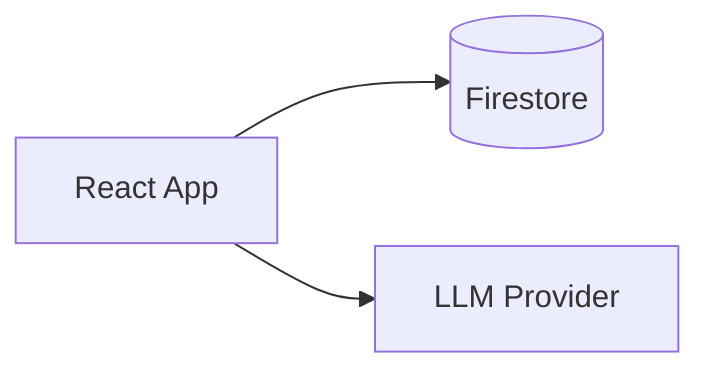

# TECH_IMPLEMENTATION.md
**Dreamer MVP — Firestore-First, Backendless**

This document consolidates the technical implementation guidance for the Dreamer MVP, updated to reflect the latest architectural decision: **no custom backend**. The web client persists directly to **Firebase Firestore** and orchestrates the AI pipeline client-side.

---

## Architecture Overview

- **Client-heavy, text-first UX** for dream capture and reflection.
- **Firestore for persistence** (system of record).
- **Client-side AI orchestration** (Extractor → Interpreter → Integrator).
- **Optional Firebase Auth (Anonymous)** for per-user isolation and secure Firestore rules.
- **Stateless pipeline where possible**: each stage is a function of explicit inputs/outputs stored as artifacts.

> Note: Calling an LLM directly from the browser can expose API keys. See **AI Orchestration & Key Safety** below for MVP-safe options.

---

## Frontend

### Stack
- React + TypeScript (Vite recommended)
- Material UI (or similar component library)
- Firebase Web SDK (Firestore + optional Auth)
- (Optional) Tokens Studio output for styling consistency:
  - `design-tokens.json` (design system source)
  - `dreamer-tokens.css` (frontend variables)

### UI building blocks (suggested)
- **DreamEditor** — dream entry (long-form textarea)
- **DreamHistory** — list + open past sessions
- **ElementCards** — Symbol/Character/Place/Emotion cards (editable)
- **AssociationForm** — prompts + valence + salience
- **HypothesisCard** — expandable hypothesis with evidence and feedback
- **IntegrationPanel** — reflective prompts + journaling

### State management (MVP)
- Keep it simple: local component state + lightweight store (optional)
- Prefer “save early, save often” via Firestore writes
- Use optimistic UI where safe (especially for edits and journaling)

---

## Firebase / Firestore

### Authentication (recommended for any public deployment)
- **Anonymous Auth** provides a stable `uid` without user friction.
- If Auth is omitted (prototype only), namespace data by a local `deviceId`—but **do not** deploy publicly without Auth and strict rules.

### Firestore Collections & Documents

> Recommended per-user structure. Timestamps are Firestore `Timestamp`.

#### `/users/{uid}`
Fields:
- `createdAt`
- `lastSeenAt`
- `settings.language` (string)
- `settings.disclaimerAcceptedAt` (Timestamp)

#### `/users/{uid}/dreams/{dreamId}`
Fields:
- `rawText` (string; optionally encrypted)
- `dreamedAt` (Timestamp; user editable; defaults to now)
- `createdAt`, `updatedAt`
- `mood` (string?)
- `lifeContext` (string?)
- `status` (enum: `draft` | `structured` | `associated` | `interpreted` | `integrated`)

#### `/users/{uid}/dreams/{dreamId}/elements/{elementId}`
Fields:
- `kind` (enum: `symbol` | `character` | `place` | `action` | `emotion` | `shift`)
- `label` (string)
- `evidence` (string[]; short anchors/excerpts)
- `order` (number; for UI ordering)
- `source` (enum: `ai` | `user`)
- `deleted` (boolean; soft delete)
- `createdAt`, `updatedAt`

#### `/users/{uid}/dreams/{dreamId}/associations/{associationId}`
Fields:
- `elementId` (string; references `elements/{elementId}` — typically kind=`symbol`)
- `associationText` (string)
- `emotionalValence` (enum: `positive` | `negative` | `mixed`)
- `salience` (number 1–5)
- `createdAt`, `updatedAt`

#### `/users/{uid}/dreams/{dreamId}/hypotheses/{hypothesisId}`
Fields:
- `lens` (enum: `compensation` | `shadow` | `archetypal_dynamics` | `relational_anima_animus` | `individuation`)
- `hypothesisText` (string; must be framed as a hypothesis)
- `evidence` (array of objects):
  - `{ type: 'dream_text' | 'element' | 'association', refId: string, quote: string }`
- `reflectiveQuestion` (string)
- `userFeedback` (enum: `resonates` | `does_not_fit` | null)
- `createdAt`, `updatedAt`

#### `/users/{uid}/dreams/{dreamId}/integration/main`
Fields:
- `reflectiveQuestions` (string[]; 1–2)
- `practiceSuggestion` (string; small, non-prescriptive)
- `journalText` (string?)
- `createdAt`, `updatedAt`

### Indexing (MVP)
- Dreams list: `dreamedAt desc` (and/or `createdAt desc`)
- Optional filtering: `status`, `updatedAt desc`

### Security Rules (MVP baseline)
- Allow read/write only where `request.auth.uid == uid`.
- Do not store any LLM API keys in Firestore.

---

## AI Pipeline (Client-Orchestrated Multi-Step)

The MVP pipeline is intentionally split into stages to prevent overinterpretation and preserve evidence-based, hypothesis-only outputs.

### 1) Extractor (No interpretation)
**Input:** raw dream text  
**Output:** descriptive elements (symbols, characters, places, emotions, etc.)  
**Rule:** no Jungian meaning, no conclusions

### 2) Association Context Builder
Combine:
- edited elements (user overrides)
- user associations (valence + salience)
into a context bundle for interpretation.

### 3) Interpreter (Hypotheses only)
**Output:** 2–3 hypotheses, each with:
- lens
- supporting evidence references
- reflective “test” question  
**Rule:** enforce “hypothesis, not conclusion” framing.

### 4) Integrator (Reflection + small practice)
**Output:**
- 1–2 reflective questions
- 1 small integration suggestion
- optional journaling prompt

### Structured outputs
Use structured JSON per stage (schemas recommended). Store only what you need for history and replay.

---

## AI Orchestration & Key Safety (Important)

Direct client calls to LLM providers can expose secrets. MVP-safe options:

1. **Bring-your-own-key (BYOK)**  
   - user pastes their API key
   - key stored **locally only** (never in Firestore)
   - simplest “no backend” option

2. **Provider with client-safe auth**  
   - if available (varies by vendor)

3. **Thin proxy later (non-MVP)**  
   - Firebase Functions or similar for secure key storage and request signing

For any public deployment, option (3) is strongly recommended.

---

## Privacy & Safety

- Consider field-level encryption for `rawText` and `journalText`.
- No training on user data by default.
- Do not log dream text; log only errors/performance.
- Prominent mental-health disclaimer; no therapeutic claims.
- Distressing content: neutral, non-alarmist handling; no medical/counseling advice.

---

## Deployment (MVP)

### Recommended
- **Firebase Hosting** (frontend)
- **Firestore** (data)
- **Firebase Auth (anonymous)** (recommended)

### Observability (minimal)
- Client error reporting (no PII / no dream text)
- Basic performance metrics (route timing, AI stage timing)

---

## Future Enhancements (Post-MVP, Optional)

- Firebase Functions as an AI proxy (secure key handling)
- Auth upgrades (email/password, OAuth)
- Cross-dream analysis and pattern detection (explicitly out of MVP scope)
- Richer moderation pipeline
